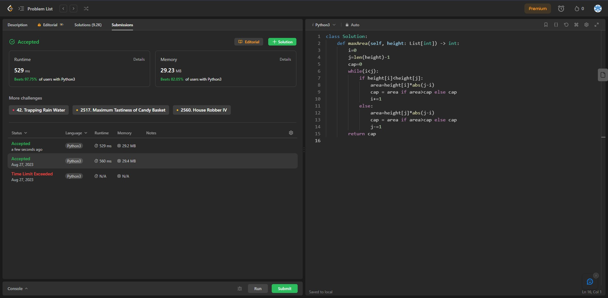

## Problem:Container With Most Water

# Statement:

<p>
You are given an integer array height of length n. There are n vertical lines drawn such that the two endpoints of the ith line are (i, 0) and (i, height[i]).

Find two lines that together with the x-axis form a container, such that the container contains the most water.

Return the maximum amount of water a container can store.

Notice that you may not slant the container.

</p>

- Date: 27th August 2023
- Difficulty: Medium
- Solved: Yes
- Problem type: Greedy Algorithm
- Language used: Python

### My solution

```
class Solution:
    def maxArea(self, height: List[int]) -> int:
        i=0
        j=len(height)-1
        cap=0
        while(i<j):
            if height[i]<height[j]:
                area=height[i]*abs(j-i)
                cap = area if area>cap else cap
                i+=1
            else:
                area=height[j]*abs(j-i)
                cap = area if area>cap else cap
                j-=1
        return cap

```

### Result


