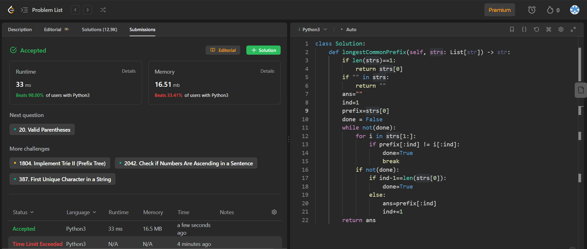

## Problem: Longest common prefix

# Statement:

<h3>
Write a function to find the longest common prefix string amongst an array of strings.

If there is no common prefix, return an empty string "".

</h3>

- Date: 15th Aug 2023
- Difficulty: Easy
- Solved: Yes
- Problem type: String type
- Language used: Python

### Initial thoughts / approaches

- Since its a string problem, best to use Python
- Brute force approach
  - Take an empty string
  - for every prefix of the first word
  - check if that is a prefix of all other words
  - if it is a prefix add it to the initialized string
  - repeat till its not a prefix
  - return initialized string
  - Result: Time limit exceeded
  - Corner case of empty list missed
  - Corner case of empty strings missed
  - Accepted

### My solution

```
    class Solution:
    def longestCommonPrefix(self, strs: List[str]) -> str:
        if len(strs)==1:
            return strs[0]
        if "" in strs:
            return ""
        ans=""
        ind=1
        prefix=strs[0]
        done = False
        while not(done):
            for i in strs[1:]:
                if prefix[:ind] != i[:ind]:
                    done=True
                    break
            if not(done):
                if ind-1==len(strs[0]):
                    done=True
                else:
                    ans=prefix[:ind]
                    ind+=1
        return ans
```

### Result



### Optimal Solutions

```
class Solution:
    def longestCommonPrefix(self, v: List[str]) -> str:
        ans=""
        v=sorted(v)
        first=v[0]
        last=v[-1]
        for i in range(min(len(first),len(last))):
            if(first[i]!=last[i]):
                return ans
            ans+=first[i]
        return ans
```

### Concepts learnt / to be learnt

    - Using sorting of lists to reduce search time complexity.
    - Learn how to reduce time complexity for array searches
