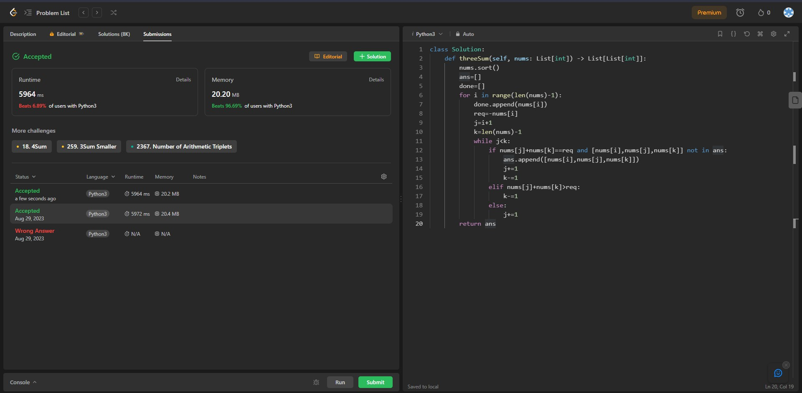

## Problem: 3Sum

# Statement:

<p>
Given an integer array nums, return all the triplets [nums[i], nums[j], nums[k]] such that i != j, i != k, and j != k, and nums[i] + nums[j] + nums[k] == 0.

Notice that the solution set must not contain duplicate triplets.

</p>

- Date: 29th August 2023
- Difficulty: Medium
- Solved: Yes
- Problem type: Two pointer
- Language used: Python

### My solution

```
class Solution:
    def threeSum(self, nums: List[int]) -> List[List[int]]:
        nums.sort()
        ans=[]
        done=[]
        for i in range(len(nums)-1):
            done.append(nums[i])
            req=-nums[i]
            j=i+1
            k=len(nums)-1
            while j<k:
                if nums[j]+nums[k]==req and [nums[i],nums[j],nums[k]] not in ans:
                    ans.append([nums[i],nums[j],nums[k]])
                    j+=1
                    k-=1
                elif nums[j]+nums[k]>req:
                    k-=1
                else:
                    j+=1
        return ans
```

### Result


