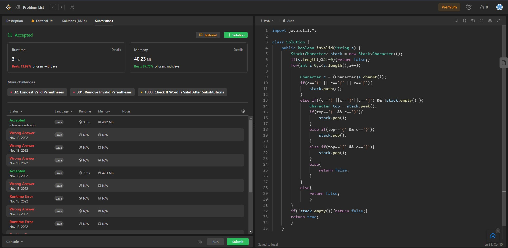

## Problem: Valid Parentheses

# Statement:

<p>
Given a string s containing just the characters '(', ')', '{', '}', '[' and ']', determine if the input string is valid.

An input string is valid if:

- Open brackets must be closed by the same type of brackets.
- Open brackets must be closed in the correct order.
- Every close bracket has a corresponding open bracket of the same type.
</p>

- Date: 23rd November 2022
- Difficulty: Easy
- Solved: Yes
- Problem type: Stack based
- Language used: Java

### My solution

```
import java.util.*;

class Solution {
    public boolean isValid(String s) {
        Stack<Character> stack = new Stack<Character>();
        if(s.length()%2!=0){return false;}
        for(int i=0;i<s.length();i++){

            Character c = (Character)s.charAt(i);
            if(c=='(' || c=='{' || c=='['){
                stack.push(c);
            }
            else if((c==')'||c=='}'||c==']') && !stack.empty() ){
                Character top = stack.peek();
                if(top=='(' && c==')'){
                    stack.pop();
                }
                else if(top=='{' && c=='}'){
                    stack.pop();
                }
                else if(top=='[' && c==']'){
                    stack.pop();
                }
                else{
                    return false;
                }
            }
            else{
                return false;
                }
        }
        if(!stack.empty()){return false;}
        return true;
        }
    }
```

### Result


