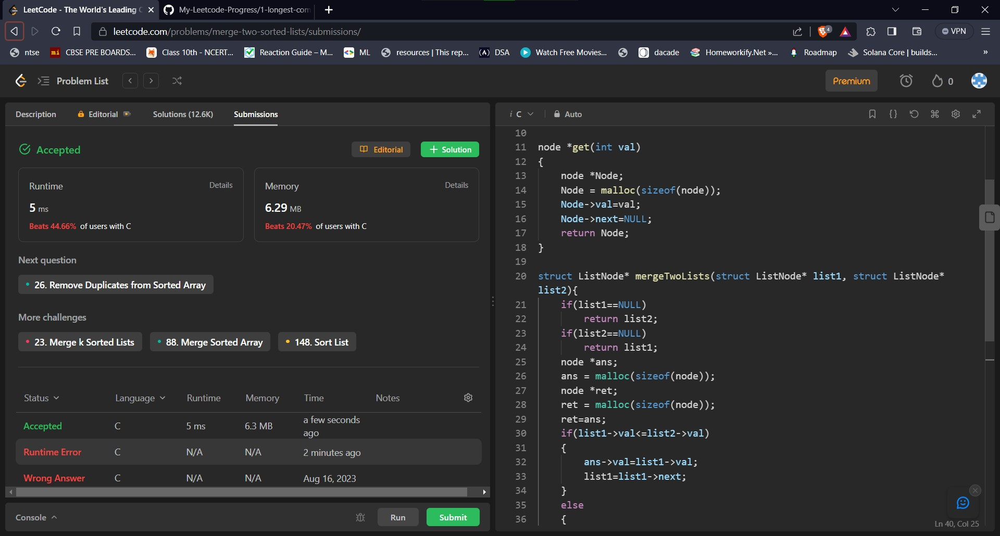

## Problem: Merge Two Sorted Lists

# Statement:

<h3>
You are given the heads of two sorted linked lists list1 and list2.

Merge the two lists into one sorted list. The list should be made by splicing together the nodes of the first two lists.

</h3>

Return the head of the merged linked list.

- Date: 19th August 2023
- Difficulty: Easy
- Solved: Yes
- Problem type: Linked Lists
- Language used: C

### Initial thoughts / approaches

- Since its a linked lists problem, a programming language with easy memory operations is to be used. Thus C is chosen for now.
- Linked lists are sorted thus no need of sorting.
- Create a head pointer (ans)for the return list. (Space complexity can be reduced by performing all operations on a single linked list)
- Start from the head of both the lists.
- Compare the current nodes value
  - Set the value of the ans = min(list1.val,list2.val)
  - Increment the ans and min valued list node
- Once either list reaches NULL node:
  - Append all the remaining nodes of the other list into the ans.
- Return ans

- This is apparently a not very efficient algo. Have to figure out why.
- I think its not very efficient because of extra memory comsumption. Here is my second algorithm

- Consider the list with the smallest element to be the result (assume list1)
- Set ptr=list2
- At every node check if list1.val <= list2.val:
  - If yes then
    - set list1.next.next=list2
    - set list1.next.next=
    - list1 = list1.next.next
- Yea this does not work.
- Yea I have to see the Optimal Solution
- Yea got a lesser space complexity score by removing the malloc for ret
- Could have been faster if I used C++, but this works fine. Could not find a good solution in C

### My solution

- Solution 1:

```
/**
 * Definition for singly-linked list.
 * struct ListNode {
 *     int val;
 *     struct ListNode *next;
 * };
 */

typedef struct ListNode node;

node *get(int val)
{
    node *Node;
    Node = malloc(sizeof(node));
    Node->val=val;
    Node->next=NULL;
    return Node;
}

struct ListNode* mergeTwoLists(struct ListNode* list1, struct ListNode* list2){
    if(list1==NULL)
        return list2;
    if(list2==NULL)
        return list1;
    node *ans;
    ans = malloc(sizeof(node));
    node *ret;
    ret = malloc(sizeof(node));
    ret=ans;
    if(list1->val<=list2->val)
    {
        ans->val=list1->val;
        list1=list1->next;
    }
    else
    {
        ans->val=list2->val;
        list2=list2->next;
    }
    while(list1!=NULL && list2!=NULL)
    {
        if(list1!=NULL && list2!=NULL && list1->val<=list2->val)
        {
            ans->next = get(list1->val);
            list1=list1->next;
            ans = ans->next;
        }
        else if(list1!=NULL && list2!=NULL)
        {
            ans->next = get(list2->val);
            ans = ans->next;
            list2=list2->next;
        }
    }
    if(list1!=NULL)
    {
        ans->next=list1;
    }
    else if(list2!=NULL)
    {
        ans->next=list2;
    }
    return ret;
}
```

### Result



### Optimal Solutions

```
class Solution {
public:
    ListNode* mergeTwoLists(ListNode* list1, ListNode* list2) {

	    // if list1 happen to be NULL
		// we will simply return list2.
        if(list1 == NULL)
            return list2;

		// if list2 happen to be NULL
		// we will simply return list1.
        if(list2 == NULL)
            return list1;

        ListNode * ptr = list1;
        if(list1 -> val > list2 -> val)
        {
            ptr = list2;
            list2 = list2 -> next;
        }
        else
        {
            list1 = list1 -> next;
        }
        ListNode *curr = ptr;

		// till one of the list doesn't reaches NULL
        while(list1 &&  list2)
        {
            if(list1 -> val < list2 -> val){
                curr->next = list1;
                list1 = list1 -> next;
            }
            else{
                curr->next = list2;
                list2 = list2 -> next;
            }
            curr = curr -> next;

        }

		// adding remaining elements of bigger list.
        if(!list1)
            curr -> next = list2;
        else
            curr -> next = list1;

        return ptr;

    }
};
```

### Concepts learnt / to be learnt

- Ways to reduce time complexity
- Understand how dynamic allocation works
