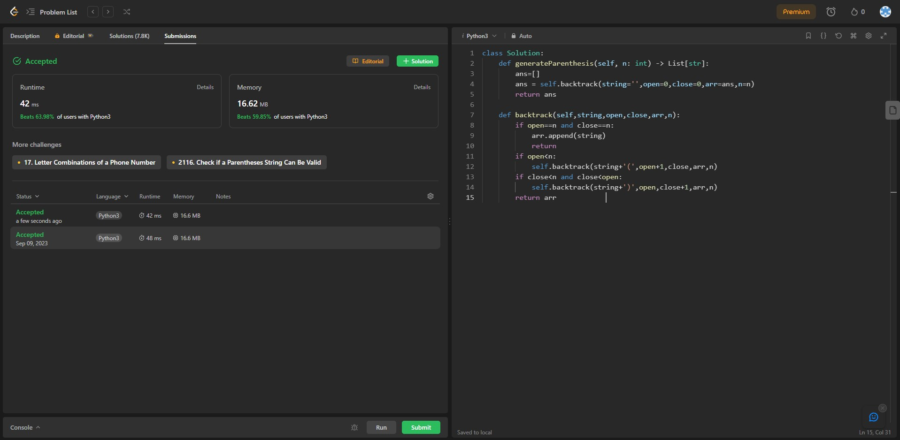

## Problem: Generate Parentheses

# Statement:

<p>
Given n pairs of parentheses, write a function to generate all combinations of well-formed parentheses.
</p>

- Date: 9th September 2023
- Difficulty: Medium
- Solved: Yes
- Problem type: Dynamic programming
- Language used: Python

### My solution

```
class Solution:
    def generateParenthesis(self, n: int) -> List[str]:
        ans=[]
        ans = self.backtrack(string='',open=0,close=0,arr=ans,n=n)
        return ans

    def backtrack(self,string,open,close,arr,n):
        if open==n and close==n:
            arr.append(string)
            return
        if open<n:
            self.backtrack(string+'(',open+1,close,arr,n)
        if close<n and close<open:
            self.backtrack(string+')',open,close+1,arr,n)
        return arr
```

### Result


