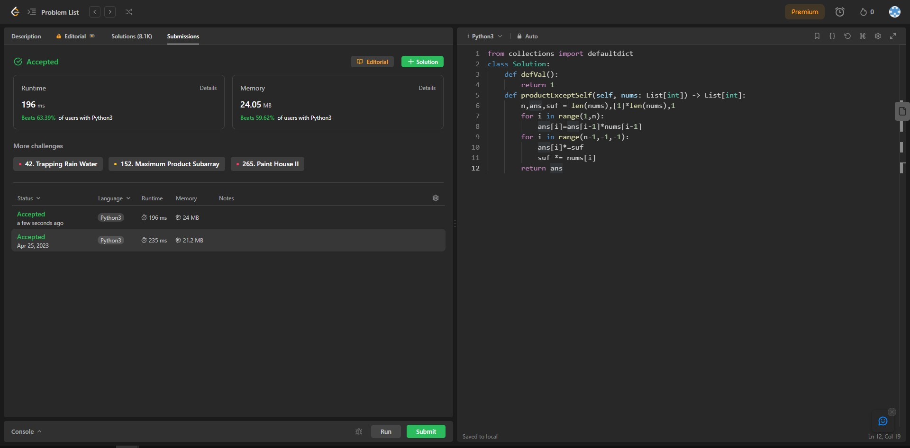

## Problem: Product of Array Except Self

# Statement:

<p>
Given an integer array nums, return an array answer such that answer[i] is equal to the product of all the elements of nums except nums[i].
The product of any prefix or suffix of nums is guaranteed to fit in a 32-bit integer.
You must write an algorithm that runs in O(n) time and without using the division operation.
</p>

- Date: 25th April 2023
- Difficulty: Medium
- Solved: Yes
- Problem type: Array
- Language used: Python

### My solution

```
from collections import defaultdict
class Solution:
    def defVal():
        return 1
    def productExceptSelf(self, nums: List[int]) -> List[int]:
        n,ans,suf = len(nums),[1]*len(nums),1
        for i in range(1,n):
            ans[i]=ans[i-1]*nums[i-1]
        for i in range(n-1,-1,-1):
            ans[i]*=suf
            suf *= nums[i]
        return ans
```

### Result


