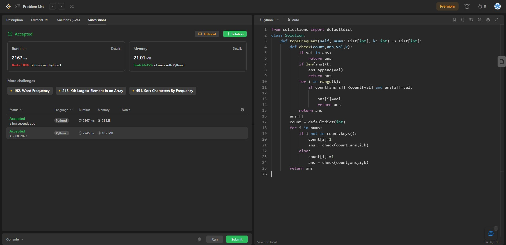

## Problem: Top K Frequent Elements

# Statement:

<p>
Given an integer array nums and an integer k, return the k most frequent elements. You may return the answer in any order.
</p>

- Date: 8th April 2023
- Difficulty: Medium
- Solved: Yes
- Problem type: Array
- Language used: Python

### My solution

```
from collections import defaultdict
class Solution:
    def topKFrequent(self, nums: List[int], k: int) -> List[int]:
        def check(count,ans,val,k):
            if val in ans:
                return ans
            if len(ans)<k:
                ans.append(val)
                return ans
            for i in range(k):
                if count[ans[i]] <count[val] and ans[i]!=val:

                    ans[i]=val
                    return ans
            return ans
        ans=[]
        count = defaultdict(int)
        for i in nums:
            if i not in count.keys():
                count[i]=1
                ans = check(count,ans,i,k)
            else:
                count[i]+=1
                ans = check(count,ans,i,k)
        return ans

```

### Result


