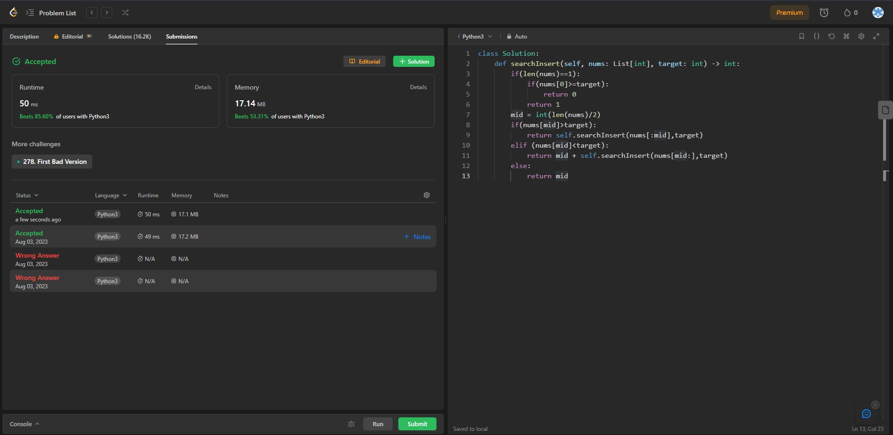

## Problem: Search Insert Position

# Statement:

<p>
Given a sorted array of distinct integers and a target value, return the index if the target is found. If not, return the index where it would be if it were inserted in order.

You must write an algorithm with O(log n) runtime complexity.

</p>

- Date: 3rd August 2023
- Difficulty: Easy
- Solved: Yes
- Problem type: Divide and conquer
- Language used: Python

### My solution

```
class Solution:
    def searchInsert(self, nums: List[int], target: int) -> int:
        if(len(nums)==1):
            if(nums[0]>=target):
                return 0
            return 1
        mid = int(len(nums)/2)
        if(nums[mid]>target):
            return self.searchInsert(nums[:mid],target)
        elif (nums[mid]<target):
            return mid + self.searchInsert(nums[mid:],target)
        else:
            return mid
```

### Result



### Optimal Solutions

### Concepts learnt / to be learnt
