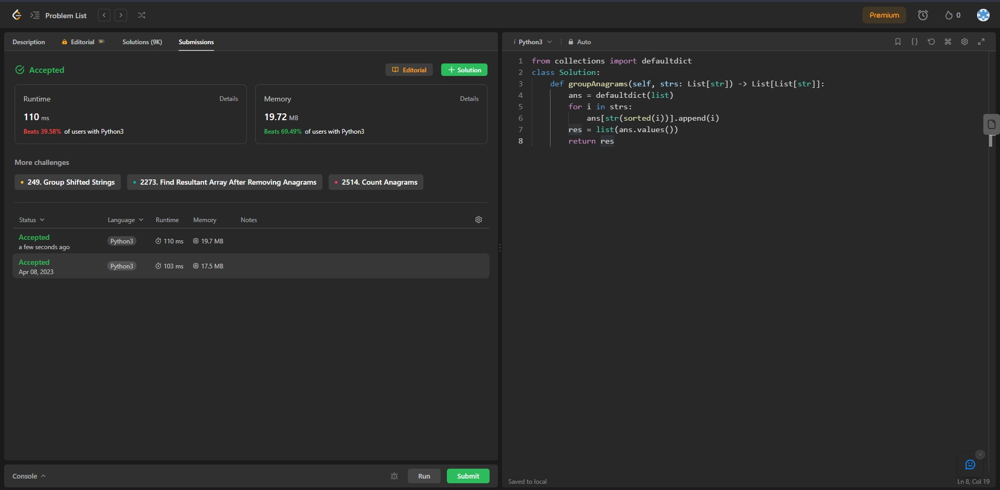

## Problem: Group Anagrams

# Statement:

<p>
Given an array of strings strs, group the anagrams together. You can return the answer in any order.
An Anagram is a word or phrase formed by rearranging the letters of a different word or phrase, typically using all the original letters exactly once.
</p>

- Date: 8th April 2023
- Difficulty: Medium
- Solved: Yes
- Problem type: String
- Language used: Python

### My solution

```
from collections import defaultdict
class Solution:
    def groupAnagrams(self, strs: List[str]) -> List[List[str]]:
        ans = defaultdict(list)
        for i in strs:
            ans[str(sorted(i))].append(i)
        res = list(ans.values())
        return res
```

### Result


