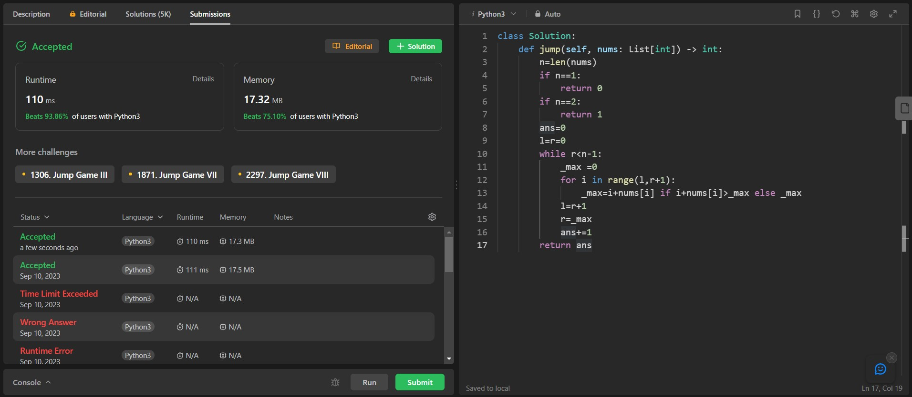

## Problem: Jump Game II

# Statement:

<p>
You are given a 0-indexed array of integers nums of length n. You are initially positioned at nums[0].
Each element nums[i] represents the maximum length of a forward jump from index i. In other words, if you are at nums[i], you can jump to any nums[i + j] where:
- 0 <= j <= nums[i]
- i + j < n
Return the minimum number of jumps to reach nums[n - 1]. The test cases are generated such that you can reach nums[n - 1].
</p>

- Date: 10th September 2023
- Difficulty: Medium
- Solved: Yes
- Problem type: Dynamic programming / Greedy algorithms
- Language used: Python

### Initial thoughts / approaches

First thoughts:

- Similar to Longest Increasing Subsequence problem
- Tried solving by DFS but couldnt
- New solution:

jump[n] = 1 + min{ jump[k] | k<n, nums[k] <= (n-k) }

- solution works.. edge cases have to be looked at.

```
def jump(self, nums: List[int]) -> int:
        n=len(nums)
        if n==1:
            return 0
        L=[1] * n
        L[0]=0
        for i in range(1,n):
            subproblems = [L[k] for k in range(1,i) if nums[k] <= (i-k)]
            L[i] = 1 + min(subproblems,default=0)
        return L[n-1]
```

works but time limit exceeded

```
def jump(self, nums: List[int]) -> int:
        n=len(nums)
        L=[1]*n
        L[0]=0
        return self.count(nums,n-1)

    def count(self,nums,i):
        if i==0:
            return 0

        count_n = 1 + min([self.count(nums,k) for k in range(i) if nums[k]>=(i-k)],default=0)
        return count_n

```

```
n=len(nums)
        if n==1:
            return 0
        if n==2:
            return 1
        L=[1] * n
        L[0]=0
        for i in range(1,n):
            subproblems = [L[k] for k in range(i) if nums[k] >= (i-k)]
            L[i] = 1 + min(subproblems,default=0)
        return L[n-1]

```

that was dynamic solution approach

- didnt fare well.. took too much time and memory

Trying greedy solution

```
n=len(nums)
        if n==1:
            return 0
        if n==2:
            return 1
        ans=0
        l=r=0
        while r<n-1:
            _max =0
            for i in range(l,r+1):
                _max=i+nums[i] if i+nums[i]>_max else _max
            l=r+1
            r=_max
            ans+=1
        return ans
```

### My solution

```
class Solution:
    def jump(self, nums: List[int]) -> int:
        n=len(nums)
        if n==1:
            return 0
        if n==2:
            return 1
        ans=0
        l=r=0
        while r<n-1:
            _max =0
            for i in range(l,r+1):
                _max=i+nums[i] if i+nums[i]>_max else _max
            l=r+1
            r=_max
            ans+=1
        return ans
```

### Result



### Concepts learnt / to be learnt

- Dynamic Programming
- Greedy Algorithm
