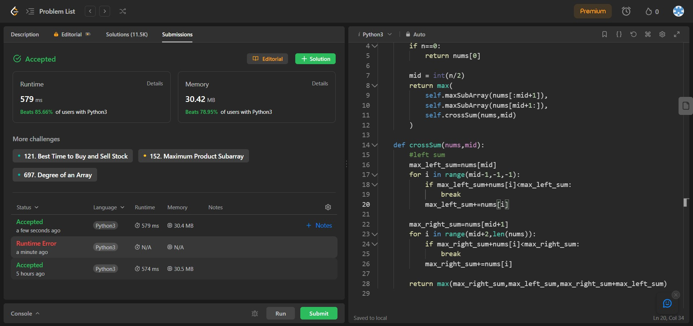

## Problem: Maximum Subarray

# Statement:

<p>
Given an integer array nums, find the 
subarray with the largest sum, and return its sum.
</p>

- Date: 11th September 2023
- Difficulty: Medium
- Solved: Yes
- Problem type: Dynamic programming / Divide and Conquer
- Language used: Python

### Initial thoughts / approaches

- Done this before
- maxSum(n) = max(leftSubSum, rightSubSum, corssSum)
- That was a divide and conquer approach. the linear time approach:
- Sliding window

### My solution

```
class Solution:
    def maxSubArray(self, nums: List[int]) -> int:
        maxSum = nums[0]
        currSum = 0
        for i in nums:
            if currSum<0:
                currSum=0
            currSum+=i
            maxSum = max(currSum,maxSum)

        return maxSum

```

### Result


### Optimal Solutions

### Concepts learnt / to be learnt

- Dynamic programming
- Divide and Conquer
