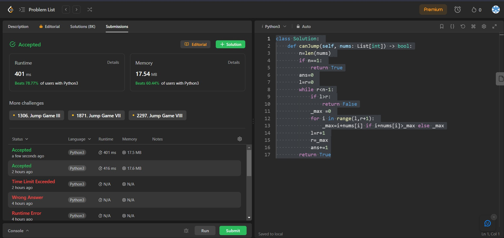

## Problem: Jump Game

# Statement:

<p>
You are given an integer array nums. You are initially positioned at the array's first index, and each element in the array represents your maximum jump length at that position.
Return true if you can reach the last index, or false otherwise.
</p>

- Date: 11th September 2023
- Difficulty: Medium
- Solved: Yes
- Problem type: Dynamic programming / Greedy Approach
- Language used: Python

### Initial thoughts / approaches

- Tried using greedy approach
- Realised its not a maxization or minimization problem
- Using dynamic approach
- Shifted back to Greedy approach with check to see if final index has been reached

### My solution

```
class Solution:
    def canJump(self, nums: List[int]) -> bool:
        n=len(nums)
        if n==1:
            return True
        ans=0
        l=r=0
        while r<n-1:
            if l>r:
                return False
            _max =0
            for i in range(l,r+1):
                _max=i+nums[i] if i+nums[i]>_max else _max
            l=r+1
            r=_max
            ans+=1
        return True
```

### Result



### Concepts learnt / to be learnt

- Dynamic Programming
- Greedy Algorithms
