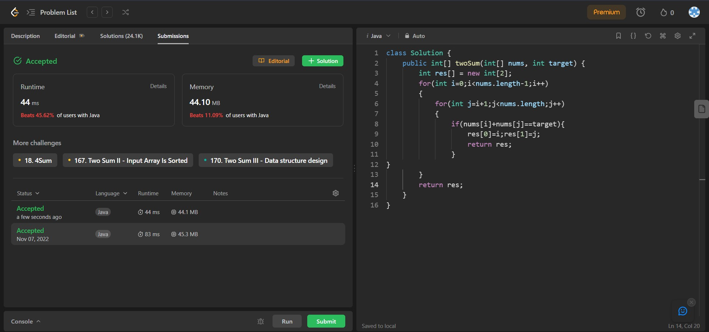

## Problem: Two Sum

# Statement:

<p>
Given an array of integers nums and an integer target, return indices of the two numbers such that they add up to target.
You may assume that each input would have exactly one solution, and you may not use the same element twice.
You can return the answer in any order.
</p>

- Date: 7th November 2022
- Difficulty: Easy
- Solved: Yes
- Problem type: Brute Force / Optimization
- Language used: Java

### My solution

```
class Solution {
    public int[] twoSum(int[] nums, int target) {
        int res[] = new int[2];
        for(int i=0;i<nums.length-1;i++)
        {
            for(int j=i+1;j<nums.length;j++)
            {
                if(nums[i]+nums[j]==target){
                    res[0]=i;res[1]=j;
                    return res;
                }
}
        }
        return res;
    }
}
```

### Result



### Concepts learnt / to be learnt

- Code optimization
- Reducing Time complexity
