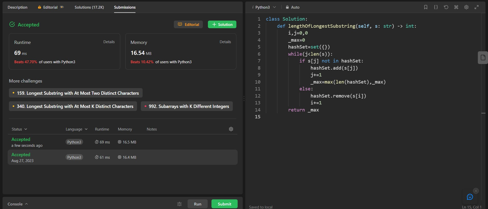

## Problem: Longest Substring Without Repeating Characters

# Statement:

<p>
Given a string s, find the length of the longest 
substring without repeating characters.
</p>

- Date: 27th August 2023
- Difficulty: Medium
- Solved: Yes
- Problem type: String type
- Language used: Python3

### My solution

```
class Solution:
    def lengthOfLongestSubstring(self, s: str) -> int:
        i,j=0,0
        _max=0
        hashSet=set({})
        while(j<len(s)):
            if s[j] not in hashSet:
                hashSet.add(s[j])
                j+=1
                _max=max(len(hashSet),_max)
            else:
                hashSet.remove(s[i])
                i+=1
        return _max

```

### Result


